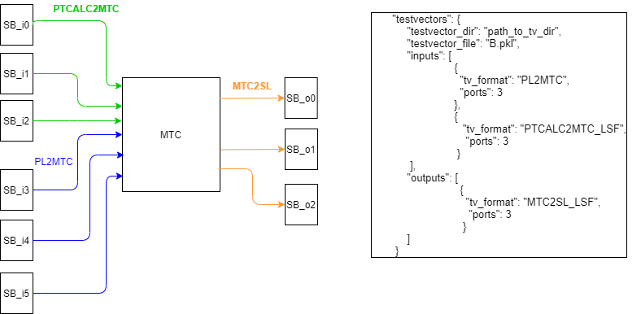

# cocotb-based testbench infrastructure for the MDT trigger processor (L0MDT TP)

This directory contains the TP's [cocotb](https://github.com/cocotb/cocotb)-based testbench
infrastructure.


Table of Contents
=================
<!--ts-->
   * [Requirements](#requirements)
      * [Python Installation](#python-installation)
   * [Installation and Setup](#installation-and-setup)
      * [The Virtual Environment Is Required](#the-virtual-environment-is-necessary-for-running-the-testbench)
      * [Fresh Installation and Reinstallation](#fresh-installation-and-reinstallation)
   * [Overview of the Testbench Infrastructure](#overview-of-the-testbench-infrastructure)
   * [Description of tb Directory Structure](#directory-structure)
   * [Anatomy of a Testbench](#testbench-structure)
   * [How to Run a Testbench](#running-a-testbench)
      * [Testbench Output](#output-generated-by-the-testbenches)
   * [How to Create a Testbench](#creating-a-testbench)
   * [Creating a Python Defined Logic Block](#defining-logic-blocks-in-python)
   * [Testbench Commands](#functionality)
      * [list](#tb-list)
      * [check-config](#tb-check-config)
      * [create](#tb-create)
      * [run](#tb-run)
      * [test-summary](#tb-test-summary)
      * [diff](#tb-diff)
      * [dump](#tb-dump)
      * [update-makefile](#tb-update-makefile)


<!--te-->

<!----------------------------------------------------------------------------->
<!----------------------------------------------------------------------------->
<!------------------------------- REQUIREMENTS -------------------------------->
<!----------------------------------------------------------------------------->
<!----------------------------------------------------------------------------->
# Requirements
In order to run the testbenches defined here you must have Python3 (>=3.8.2) installed
on your machine and accessible via the `python3` command in your `$PATH`.


## Python from CVMFS

One can obtain a recent python version from CVMFS. For that, you have to setup
your environment as follows: Either run
```bash
export ATLAS_LOCAL_ROOT_BASE=/cvmfs/atlas.cern.ch/repo/ATLASLocalRootBase
source ${ATLAS_LOCAL_ROOT_BASE}/user/atlasLocalSetup.sh
```
or define a function in your `.bashrc` which does it for you
```bash
# Define setupATLAS
function setupATLAS () {
    # ATLAS environment variables
    export ATLAS_LOCAL_ROOT_BASE=/cvmfs/atlas.cern.ch/repo/ATLASLocalRootBase
    source ${ATLAS_LOCAL_ROOT_BASE}/user/atlasLocalSetup.sh
}
```
and then call that function via `setupATLAS` when needed. Afterwards you can obtain
python 3 from CVMFS via
```bash
lsetup "lcgenv -p LCG_98python3 x86_64-centos7-gcc9-opt Python"
```
This gives you the current python 3 version from CVMFS as of this writing (2020-9-23).
Newer versions will be published occasionally, with an overview over all
available packages being given at [http://lcginfo.cern.ch](http://lcginfo.cern.ch).


## Custom python installation


If you need to install python3, there are many places online showing how to do this.
For example, [here](https://realpython.com/installing-python/).

One easy way to do it is by installing 'pyenv' and use 'pyenv' to install python3 for you.

<!--
 Additionally, you can find an installation script at [this repository](https://github.com/dantrim/danny_installs_python) that will install python for you. Beware, python compilation depends on external system libraries and so running the script at that repository straight out of the box may fail. Use it as a guide. It has been tested on MacOSX as well as CentOS7.
 -->

To install [pyenv](https://realpython.com/intro-to-pyenv/), follow [these instructions](https://github.com/pyenv/pyenv-installer).
You can check that:
```bash
curl https://pyenv.run | bash
```
suceeded after you have added these lines to your `.bashrc` and re-source it:
```bash
export PATH="#HOME/.pyenv/bin:$PATH"
eval "$(pyenv init -)"
eval "$(pyenv virtualenv-init -)"
```
then run:
```bash
pyenv --help
```
If this suceed, you are good to go to install python3
```bash
pyenv install -v 3.8.2
pyenv global 3.8.2
pyenv which python
```

If you will need 'libpython.so` (eg using cocoTB), in that case install python using:
```bash
env PYTHON_CONFIGURE_OPTS="--enable-shared"  pyenv install -v 3.8.2
```

You can add to your `.bashrc`:
```bash
alias python='$HOME/.pyenv/versions/3.8.2/bin/python'
```
Any additonal python packages (eg: tensorflow, keras, numpy, pandas, tables, matplotlib, hls4ml, jupyter etc...) can be install with:
```bash
python -m pip install <package_name>
```


For cocoTB, you will need to have `libpython.so`, in that case install python using:
```bash
env PYTHON_CONFIGURE_OPTS="--enable-shared"  pyenv install -v 3.8.3
```

Once python3 is installed under your user account, update pip:
```bash
pip install --upgrade pip
```

If you never run python, you may need to add under your `${HOME}` area, a file named `.pythonrc.py` containing:
```python
# file: ~/.pythonrc.py
## for tab-completion
import rlcompleter, readline
readline.parse_and_bind('tab: complete')
readline.parse_and_bind('set show-all-if-ambiguous On')

## for history
import os, atexit
f = os.path.join(os.environ["HOME"], ".python_history")
try:            readline.read_history_file(f)
except IOError: pass
atexit.register(readline.write_history_file, f)
## EOF ##
```

<!----------------------------------------------------------------------------->
<!----------------------------------------------------------------------------->
<!--------------------------- INSTALLATION AND SETUP -------------------------->
<!----------------------------------------------------------------------------->
<!----------------------------------------------------------------------------->
# Installation and Setup
<!-- <details> <summary> Expand </summary> -->

If you have confirmed that you have `python3`, `Xilinx and Questa` tools on your machine, then following environment variables would need to be setup
```bash
#!/bin/bash
export L0MDT_TESTVECTOR_DIR=<Test Vector Directory>
export XILINX_SIM_LIB=<Xilinx Vivado Compiled Libraries (Unisim)>
#Run Xilinx setup scripts
source /opt/tools/Xilinx/Vivado/2020.2/settings64.sh
#Include Questa in Path
PATH=/opt/tools/Questasim/QuestaSIM-10.7c/linux_x86_64:$PATH
#Set up LM_LICENSE_PATH for Questa and Xilinx tools
```

the only
thing that you need to do to install all requirements for running the cocotb-based
testbenches is to run,
```bash
$ source setup_env.sh -l $XILINX_SIM_LIB -t $L0MDT_TESTVECTOR_DIR -x $XILINX_VIVADO
(env) $
```
Simulation library locations in UCI machines
uciatlaslab -  /opt/tools/Xilinx/compiled_libraries/v2020.2
uclhc-2 - /DFS-L/DATA/atlas/psundara/xilinx/compiled_libraries/v2020.2/

You should make sure that you are using compatible branches for cocotb and TV, IPs etc, ie that the test vector tag uses the same DataFormat version that was used to generate and now read the test vectors, and the IPs also use the same DataFormat.


`setup_env.sh` will install all dependencies (cocotb, third-party packages, etc...).
The installation
is handled by [pip](https://pypi.org/project/pip/) and [setuptools](https://pypi.org/project/setuptools/).
You can inspect [setup.py](setup.py) to see the package and installation configuration.


Once the above command completes succesfully, you will be in a python virtual environment
(indicated by the "`(env) $`" at your terminal command prompt instead of the usual "`$`").
If you are unfamiliar with the concept of virtual environments, see [here](https://docs.python.org/3/tutorial/venv.html)
or [here](https://realpython.com/python-virtual-environments-a-primer/).

To exit the virtual environment run,
```bash
(env) $ deactivate
$
```

To ensure that the testbench infrastructure has been installed properly, after sourcing
the `setup_env.sh` script as in the above you should have the command "`tb`" available to you in your
path (within the virtual environment). You should be able to print its help message to
the screen by running,
```bash
(env) $ tb -h
Usage: tb [OPTIONS] COMMAND [ARGS]...

  Top-level entrypoint into TP fw cocotb test-bench infrastructure.

Options:
  -h, --help  Show this message and exit.

Commands:
  check-config     Check/inspect a testbench's configuration (*.json) file.
  create           Create a new test.
  list             List all available testbenches and their status.
  run              Setup and run cocotb-based testbenches.
```
If you see the above help message after running the top-level "`tb`" command then
you should be on your way to running the testbench infrastructure.

## Run a test bench

Run one of these commands from tools/cocotb:
```bash
tb run test_config/config_mtc.json
tb run test_config/config_lsf.json
tb run test_config/config_ptcalc.json
tb run test_config/config_pl_mtc.json
```


## The virtual environment is necessary for running the testbench
In order to return back to the virtual environment for the cocotb testbenches,
simply run,
```bash
$ source setup_env.sh
(env) $
```
Subsequent calls to this script will not attempt to re-install the package, but will only
initialize the virtual environment and ensure that the top-level entrypoint "`tb`" is accessible.

That is, **`setup_env.sh` must be sourced every time you return back to running the testbenches**.

## Fresh Installation and Reinstallation
If you wish to make a clean installation, simply delete the `env/` directory created when you
ran `setup_env.sh` and re-run the installation procedure,
```bash
$ rm -rf env/
$ source setup_env.sh -l <XILINX_SIM_LIB> -t <L0MDT_TESTVECTOR_DIR> -x $XILINX_VIVADO
(env) $ # everything is all fresh now
```
<!-- </details> -->

<!----------------------------------------------------------------------------->
<!----------------------------------------------------------------------------->
<!------------------------------- OVERVIEW ------------------------------------>
<!----------------------------------------------------------------------------->
<!----------------------------------------------------------------------------->
# Overview of the Testbench Infrastructure

The `cocotb`-based testbench infrastructure laid out in this repository is based
around testing logic blocks that are interfaced to Spybuffer (`"Spy+FIFO"`) blocks.Blocks that do not require FIFO at the input interface should configure the SpyBuffer in `Passthrough` mode. This would drive data,data_valid signals for a interface.
Inserting SpyBuffers would simplify writing testbench for multiple blocks as support for driver, monitor cocotb coroutines are required only for the FIFO interface of the SpyBuffer block.
This would result in quick turnaround for testing of blocks in the firmware


Given this testing strategy, the testbench infrastructure here laid out is
based around designers providing their logic block that they wish to test and
having it's inputs and outputs interfaced directly to `Spy+FIFO` blocks.
The MTC block is provided as an `DUT` example in the figure below:
<div align="center">

</div>

Once the `DUT` is interfaced to `Spy+FIFO` blocks as in the above, the
`cocotb` testbench can be constructed. `cocotb` is a `python` based testbench
framework that runs `python` defined coroutines side-by-side with the
RTL simulation. A `cocotb` testbench has complete access to all signals
(internal and external) of the `DUT` and provides methods for designers of
testbenches to drive signals onto the inputs of the toplevel design,
monitor the outputs of the toplevel design, and even control internal registers
inside of simulation time. It is a powerful tool, and complete information can
be found in the [official documentation](https://docs.cocotb.org/en/latest/).

With the "`Spy+FIFO`-generalized interface" assumed for all designs to be tested
by the testbench infrastructure, providing utilities for creating testbenches
and driving & monitoring the designs is relatively straightforward given
enough familiarity with `python` and `cocotb`.

The main idea of developing testbenches with this "`Spy+FIFO` generalized interface"
is illustrated by the following figure,
<div align="center">
    
</div>
and the minimal order of operations can be listed as:

 1. (`HDL`) Design a logic block that you wish to test.
 2. (`HDL`) Wrap the design in `Spy+FIFO` blocks (one such block for each input and output)
 3. (`python`) Construct a `cocotb` test module that initializes the `DUT` (the `Spy+FIFO`-wrapped design)
 4. (`python`) Use [FifoDrivers](https://gitlab.cern.ch/atlas-tdaq-phase2-l0mdt-electronics/l0mdt-hdl-design/-/blob/devel/cocotb/src/l0mdt_tb/utils/fifo_wrapper.py#L146) to drive input testvector data onto the `DUT` inputs
 5. (`python`) Use [FifoMonitors](https://gitlab.cern.ch/atlas-tdaq-phase2-l0mdt-electronics/l0mdt-hdl-design/-/blob/devel/cocotb/src/l0mdt_tb/utils/fifo_wrapper.py#L202) to monitor the `DUT` output signals
 6. (`python`) Compare the signals observed by the [FifoMonitors] to the output testvectors

The work necessary to perform steps 2-6 are, for the most part, handled entirely
by the testbench infrastructure laid out in this repository.
As a designer of a logic block, you really only need to provide the testbench
infrastructure with the source files for your logic design and plug them into
`Spy+FIFO` blocks.
Most of the leg work to perform the rest is done by utilizing the testbench infrastructure
described in the [rest of this README](#directory-structure).

**Note 1:** Given the flexibility and strength of the `cocotb` framework, users
can define logic blocks *entirely within python*. That is, you do  not need to
have the logic defined and laid out in HDL/RTL (as illustrated in the above figure)
at all. If you wish to study yet-to-be-designed logic, or add additional control
logic to a design's interface(s), you can create it entirely within `python` by
leveraging `cocotb` constructs.
The testbench infrastructure laid out in this repository provides means for
users to put together the initial stages of a pure software-defined logic block.
See the section [Creating a Python Defined Logic Block](#defining-logic-blocks-in-python)
for more information.

**Note 2:** There is no limit to the number of firmware blocks that can be tested
at a single time. That is, you can chain together any number of firmware logic
blocks --- with `Spy+FIFO` interconnects --- and use the testbench infrastructure
to test the combined logic. An example for testing multiple blocks is shown in the following figure:

<div align="center">

</div>

By default, the testbench infrastructure will drive and monitor only the **outermost**
`Spy+FIFO` blocks. Monitoring any internal `Spy+FIFO` blocks can be done by the user
adding the necessary code to their `cocotb` test module, in the same way as adding
any code to monitor or drive internal signals of the `DUT` (here we use `"DUT"` to
not refer to the `Spy+FIFO` logic).


<!----------------------------------------------------------------------------->
<!----------------------------------------------------------------------------->
<!-------------------------- DIRECTORY STRUCTURE ------------------------------>
<!----------------------------------------------------------------------------->
<!----------------------------------------------------------------------------->
# Directory Structure

```
cocotb/
 ├── schema/
 ├── src/
 │   └── l0mdt_tb/
 │       ├── cli/
 │       ├── creator/
 │       ├── utils/
 │       └── testbench/
 │           ├── mtc_auto/
 │           ├── ptcalc/
 │           └── lsf_auto/
 └──test_config/
```

The layout of the `cocotb` directory is illustrated in the above schematic (produced from a reduced `tree` command). Below a brief description
is given of each of the `tb` sub-directories.


### cocotb/schema

This directory holds the `JSON` schema files for `JSON` structures relevant to
the testbench infrastructure.

If you are unfamiliar with how to specify or define a schema for `JSON`, and validate
`JSON` objects within python, see the [Understanding JSON Schema page](https://json-schema.org/understanding-json-schema/index.html)
and the [jsonschema repository](https://github.com/Julian/jsonschema).

### cocotb/test_config

This directory holds the `JSON` configuration files for each of the defined tests.
Users must provide a test configuration to the [tb run](#tb-run) command in order
to run testbenches.

Testbench conifguration files must satisfy the schema defined in [schema/schema_test_config.json](schema/schema_test_config.json). There can be multiple configuration files for same testbench

### cocotb/src/l0mdt_tb

Directory containing testbench implementation and modules for creating testbenches.

### l0mdt_tb/cli

Directory defining the top-level command-line-interface (CLI) for the testbench infrastructure.
It is here where the top-level executable `tb`, and it's [sub-commands](#functionality), are defined.

### l0mdt_tb/creator

This directory holds the module that is responsible for creating new testbenches from
pre-defined template ("skeleton") files. The [tb create](#tb-create) utility looks in here
for defining tests.

**Note:** If the format of testbenches change, the [creator module](https://gitlab.cern.ch/atlas-tdaq-phase2-l0mdt-electronics/l0mdt-hdl-design/-/blob/devel/cocotb/src/l0mdt_tb/creator/creator.py)
will need to be updated accordingly, as well as any templates located in this directory.

### l0mdt_tb/utils

This directory houses modules necessary for building and running `cocotb` testbenches,
as well as other miscellaneous utility methods and modules.
Defined testbenches will rely on modules and classes implemented in this directory.

### l0mdt_tb/testbench

This directory is where defined `cocotb` testbenches reside. In the above there
are three defined testbenches: `mtc_auto` and `ptcalc`.


# Cocotb Makefiles
By default, CocoTB's underlying `Makefile` that it uses for its QuestaSim simulator, located at
`$(cocotb-config --makefiles)/simulators/Makefile.questa`, does not support compile VHDL files into user specific library.
When setting up cocotb python environment, the setup_env.sh scripts updates CocoTB Makefile to support VHDL files to get compiled into libraries

**Note:** If in future releases of `cocotb` the structure of the makefiles under `$(cocotb-config --makefiles)/simulators` change,
then the code in setup_env,sh may have to be updated to work with latest Makefile

# Testbench Structure

For details on how a given testbench is laid out and what is the minimal setup,
see the [testbench structure page](doc/testbench_structure.md).


<!----------------------------------------------------------------------------->
<!----------------------------------------------------------------------------->
<!---------------------------- RUNNING A TESTBENCH ---------------------------->
<!----------------------------------------------------------------------------->
<!----------------------------------------------------------------------------->
# Running a Testbench
<!-- <details> <summary> Expand </summary> -->

To run a testbench, do following:

```bash
$ source setup_env.sh  -c <XILINX SIMULATION LIBRARIES> -t <TEST VECTOR DIRECTORY>
(env) $ tb run test_config/config_<test_name>.json
```
which will result in plenty of output to the screen generated by the RTL compilation and by cocotb and the RTL simulation running.

If one does not want to use the hardcoded paths for the compiled libraries and the testvectors,
one can supply alternative paths:
```bash
(env) $ COMPONENTS_LIB_DIR=/path/to/xilinx_compiled_libraries/ L0MDT_TESTVECTOR_DIR=/path/to/testvectors tb run test_config/config_<test_name>.json
```

The results of the tests that we run within a given testbench are printed to the screen at the end of the test. For example:
```bash


# ***************************
# Sector 3 Event: 0  Candidate= 0 TVFORMAT= MTC2SL_LSF
# The 2 BitFieldWords are identical
# ***************************
# Sector 3 Event: 0  Candidate= 1 TVFORMAT= MTC2SL_LSF
# The 2 BitFieldWords are identical
# ***************************
# Sector 3 Event: 0  Candidate= 2 TVFORMAT= MTC2SL_LSF
# The 2 BitFieldWords are identical
# ***************************
# Sector 3 Event: 1  Candidate= 0 TVFORMAT= MTC2SL_LSF
# The 2 BitFieldWords are identical
# ***************************
# Sector 3 Event: 1  Candidate= 1 TVFORMAT= MTC2SL_LSF
# The 2 BitFieldWords are identical
# ***************************
# Sector 3 Event: 1  Candidate= 2 TVFORMAT= MTC2SL_LSF
# The 2 BitFieldWords are identical
```


along with the `cocotb` result being reported:
```bash
         Test Passed: mtc_auto_test
         Passed 1 tests (0 skipped)
         *************************************************************************************
         ** TEST                         PASS/FAIL  SIM TIME(NS)  REAL TIME(S)  RATIO(NS/S) **
         *************************************************************************************
         ** test_mtc_auto.mtc_auto_test    PASS        20110.00         48.39       415.56  **
         *************************************************************************************

```

Testbench framwork support bit by bit comparison of dataformats with expected value from TV package. An example is shown below
```bash
# ***************************
# Sector 3 Event: 2  Candidate= 0 TVFORMAT= PTCALC2MTC_LSF
# The 2 BitFieldWords differ
# +---------------+-------+-------+--------+
# | NAME          |   EXP |   RTL |   DIFF |
# |---------------+-------+-------+--------|
# | data_valid    |     1 |     1 |      0 |
# | slcid         |     1 |     1 |      0 |
# | slid          |     0 |     0 |      0 |
# | bcid          |  1550 |  1550 |      0 |
# | mdt_eta       |   156 |   158 |      1 |
# | mdt_pt        |    47 |    48 |      1 |
# | mdt_ptthresh  |     5 |     0 |      1 |
# | mdt_charge    |     1 |     0 |      1 |
# | mdt_nsegments |     3 |     3 |      0 |
# | mdt_quality   |     0 |     7 |      1 |
# +---------------+-------+-------+--------+
# ***************************
```
Block based verification scripts would have to be written to allow error tolerance based on block implementation

## Output Generated by the Testbenches
Output generated by the test (from both cocotb and by our testbench) will be located in the `tb/test_output/<test_name>` directory.
If this directory does not exist before running the test, it will get made prior to the test.

The output of primary interest are:

* Waveform files (\*.wlf)
* Data (\*.evt) files generated by the testbenches (e.g. fifodriver\*.evt and fifomonitor\*.evt files)
* Test result summary files (`test_results_summary_*.json`)

The data files named "`fifodriver*.evt`" correspond to the data being driven into the DUT *inputs*.
The data files named "`fifomonitor*.evt`" correspond to the data observed at the DUT *outputs*.
There are analogously named `*timing*.txt` files which contain the timestamp information for the data seen in each
of the FIFO blocks associated with the generated `fifo*.evt` files.

<!-- </details> -->

<!----------------------------------------------------------------------------->
<!----------------------------------------------------------------------------->
<!--------------------------- CREATING A TESTBENCH ---------------------------->
<!----------------------------------------------------------------------------->
<!----------------------------------------------------------------------------->
# Creating a Testbench

To learn how to create a testbench from scratch using the [tb create](#tb-create)
utility, see the [Creating a Testbench page](doc/creating_a_testbench.md).

<!----------------------------------------------------------------------------->
<!----------------------------------------------------------------------------->
<!------------------------ SOFTWARE DEFINED BLOCKS ---------------------------->
<!----------------------------------------------------------------------------->
<!----------------------------------------------------------------------------->
# Defining Logic Blocks in Python

To learn how to create and instantiate a logic block defined purely in python,
see the [Creating a Logic Block in Python page](doc/software_block.md).

<!----------------------------------------------------------------------------->
<!----------------------------------------------------------------------------->
<!------------------------------ FUNCTIONALITY -------------------------------->
<!----------------------------------------------------------------------------->
<!----------------------------------------------------------------------------->
# Functionality
<!-- <details> <summary> Expand </summary> -->

Here each of the ```tb``` commands will be briefly described.

All `tb` commands available to you are listed by printing the help message:
```bash
(env) $ tb -h
Usage: tb [OPTIONS] COMMAND [ARGS]...

  Top-level entrypoint into TP fw cocotb test-bench infrastructure.

Options:
  -h, --help  Show this message and exit.

Commands:
  check-config     Check/inspect a testbench's configuration (*.json) file.
  create           Create a new test.
  list             List all available testbenches and their status.
  run              Setup and run cocotb-based testbenches.
```
Each command has it's own set of arguments and options, which can be accessed by
```bash
(env) $ tb [command] -h
```

<!-- <details> <summary> <strong>check-config</strong> (click to expand) </summary> -->
## tb check-config

```bash
(env) $ tb check-config -h
Usage: tb check-config [OPTIONS] CONFIG

  Check/inspect a testbench's configuration (*.json) file.

```

The `check-config` command is for inspecting a testbench configuration JSON file.
A testbench's configuration is placed in the [test_config/](test_config/) directory.
For example, here is [test_config/config_ptcalc.json](test_config/config_ptcalc.json):
```json
{
     "testbench_config": {
        "test_name": "ptcalc",
        "input_args": {
            "n_events": 4,
            "event_detail": false,
            "clock_period": 5,
            "clock_time_unit": "ns",
	    "ptcalc_ii": 24,
            "_COMMENT": "Environment variables COMPONENTS_LIB_DIR, L0MDT_TESTVECTOR_DIR overrides components_lib_dir, testvector_dir definition"
        },
        "run_config": {
            "output_directory_name": "ptcalc",
            "test_location": "src/l0mdt_tb/testbench/ptcalc/test",
        },
}
```


To check that a testbench configuration is sound, simply provide `check-config` the path to
a testbench JSON configuration file. If the configuration is valid you will be told accordingly.
Here is an example using [test_config/config_ptcalc.json](test_config/config_ptcalc.json):
```bash
(env) $ tb check-config test_config/config_b2b.json
Test configuration OK
```


<!-- </details> -->

<!-- <details> <summary> <strong>create</strong> (click to expand) </summary> -->
## tb create

```bash
(env) $ tb create -h
Usage: tb create [OPTIONS]

  Create a new test.

Options:
  --software-block                     Indicate if you require a software block to be
                                       generated

  -o, --n-outputs-interfaces INTEGER   Specify the number of output ports for the DUT
                                       [required]

  -i, --n-inputs-interfaces INTEGER   Specify the number of input ports for the DUT
                                      [required]

  -t, --test-name TEXT                Give the test a name  [required]
  -op, --ports_in_output_interface TEXT
                                      Give number of ports(comma separated) in
                                      each output interface (E.g 3 if n_outputs=1.
                                      Default is 1

  -ip, --ports_in_input_interface TEXT
                                     Give number of ports(comma separated) in
                                     each input interface (E.g 3,3,3 if
                                     n_inputs=3). Default is 1
  -h, --help                         Show this message and exit.
```

The `create` command can be used as a means to create from scratch a brand new testbench.
It produces the necessary files to get a user up and running with passing testvectors through
a DUT with minimal changes required to the files that are created.

**Note: If you wish to understand what are the minimum requirements for setting up a testbench, you should
understand the files and directories that get generated by `tb create`. This structure is
fully described in the [Testbench Structure section](#testbench-structure).**

The `-i|--n-inputs-interfaces` and `-o|--n-outputs-interfaces` options correspond to the number of input
and output interfaces to the `DUT`. This is basically the dataformat definition at input and output of 'DUT'.

The `-ip|--ports_in_input_interface` and `-op|--n-outputs-interfaces` options correspond to number of ports in each interface. The values should be comma separated. The order should match the interface definition in JSON file.

The `-t|--test-name` option defines the name of the testbench. This has consequences for the
naming of the testbenches directory structure, testbench module and class names, etc...

The `--software-block` option will create a skeleton for a python-defined logic block and place it in the CocoTB
test module. This has not been tested

For example, if I wish to create a testbench for a new firmware block called `dummy_block` that has
`2` input dataformat interfaces and `1` output dataformat interfaces, I would do:

```bash
(env) $ tb create -t dummy_block -i 2 -o 1
Creating test "dummy_block" with 2 input interface(s) and 1 output interface(s).
```
For above case each dataformat interface has 1 port.

If in the above example, the first input interface has 3 ports and the second input interface has 1 ports, the create commad would be as follows

```bash
(env) $ tb create -t dummy_block -i 2 -o 1 -ip 3,1
Creating test "dummy_block" with 2 input interface(s) and 1 output interface(s).
```

For above case, first input dataformat defined in JSON file of dummy_block has 3 ports and second input dataformat has 1 port


At this point the following directory structure related to this new testbench is as follows:

```
tb/
├── src/
│   ├── tp_tb/
│       ├── testbench/
│           ├── dummy_block/
│               ├── README.md
│               ├── dummy_block_ports.py
│               ├── dummy_block_utils.py
│               ├── dummy_block_wrapper.py
│               ├── test/
│                   ├── Makefile
│                   ├── test_dummy_block.py
│                   ├── TopLevel_dummy_block.v
│
├── test_config
     ├── config_dummy_block.json
```

You can see the following files created:


* `<test_name>_ports.py`: A file containing enum descriptors for each of the DUT inputs and outputs [**user should update names of enumerated `Inputs` and `Outputs`**]
* `<test_name>_utils.py`: A file to put any utility/helper functions that you may need in defining your test (by default it has an empty function that you can implement)
* `<test_name>_wrapper.py`: A file defining the `BlockWrapper` for your DUT that contains the methods for driving input testvectors into the DUT
* `test/Makefile`: This is the CocoTB Makefile, in which the user must add additional HDL source files for their DUT and update include paths/etc as needed
* `test/test_<test_name>.py`: This is the CocoTB test module, where you define your testbench
* `test/TopLevel_<test_name>.v`: This is the testbench TopLevel DUT, where you will connect your DUT to the outer input and output Spy+FIFO blocks that are autogenerated for you
* `test_config/config_<test_name>.json`: This is the testbench configuration, where you will need to update input arguments for your tests, specify testvectors, etc...

For the ptcalc port, we have 2 input interfaces (SF2PTCALC, PL2PTCALC) and one output interface (PTCALC2MTC). SF2PTCALC has 3 input ports, PL2PTCALC has 1 port.
PTCALC2MTC has one port. For this case following commands creates testbench:
(env) $ tb create -t ptcalc -i 2 -o 1 -ip 3,1 -op 1

<!-- </details> -->

<!-- <details> <summary> <strong>list</strong> (click to expand)  </summary> -->
## tb list

```bash
(env) $ tb list -h
Usage: tb list [OPTIONS]

  List all available testbenches (and their tests).

Options:
  -h, --help  Show this message and exit.
```

The `list` utility inspects the testbench directories and finds all properly configured
testbenches that are available to be run. It takes no arguments:

```bash
(env) $ tb list
Defined testbenches:
ptcalc,
mtc_auto
```

<!-- </details> -->

<!-- <details> <summary> <strong> run </strong> (click to expand)  </summary> -->
## tb run

```bash
(env) $ tb run -h
Usage: tb run [OPTIONS] CONFIG

  Setup and run cocotb-based testbenches.

Options:
  -h, --help  Show this message and exit.
```

The `run` command is the primary driver of testbenches. You call this when you want to run a testbench.
It takes only a single argument, which is the testbench configuration JSON file that describes the
test you wish to run. For example,

```bash
(env) $ tb run test_config/config_ptcalc.json
```
Calling `run` will check that the testbench is configured properly and will construct the
command that will ultimately execute the compilation of the RTL source files and the running
of cocotb. Basically, it is nearly the same as setting up your testbench environment and calling
`make` on the cocotb-configured Makefile for your test.

The path to the provided testbench configuration file is passed to the cocotb tests and
can be used internally. In this way, the user can specify "input arguments" to pass to their
test that may change it's behavior. This is the "`input_args`" field of the testbench configuration
file. In the case of the `ptcalc` testbench these are (c.f. `tb check-config --dump test_config/config_b2b.json`):
```bash
"input_args" :
{
    "n_events" : 10
    ,"event_delays" : true
    ,"event_detail" : false
    ,"clock_period" : 5
    ,"clock_time_unit" : "ns"
}
```
It is up to the designer of the specific testbench to ensure that these "input_args" are properly
handled within their test, or have suitable defaults in the case of their absence within the
testbench's JSON configuration.


<!-- </details> -->


<!-- </details> -->


